# AI Trading Terminal

A Bloomberg-style, **paper-first** algorithmic trading terminal: a deterministic strategy + risk engine, AI market research, real-time charts, weekly options flow & contract selection, a natural-language **chat over your own database**, and a guided bot builder. Built on [Alpaca](https://alpaca.markets) for commission-free US equities/ETFs/options.

It ships in **two forms from one codebase**:
1. 🖥️ **Native macOS app** — a self-contained `.app` with an **embedded SQLite** database (no external DB needed).
2. 🌐 **Web app** — a single Rust binary that serves the whole UI on `http://localhost:8001`, backed by **MySQL**.

The two stay in sync automatically (SQLite ↔ MySQL).

---

## 📸 Screenshots

> The native macOS app (paper account, live Alpaca data).

### Dashboard — equity, watchlist, live chart, research feed, activity log & bots
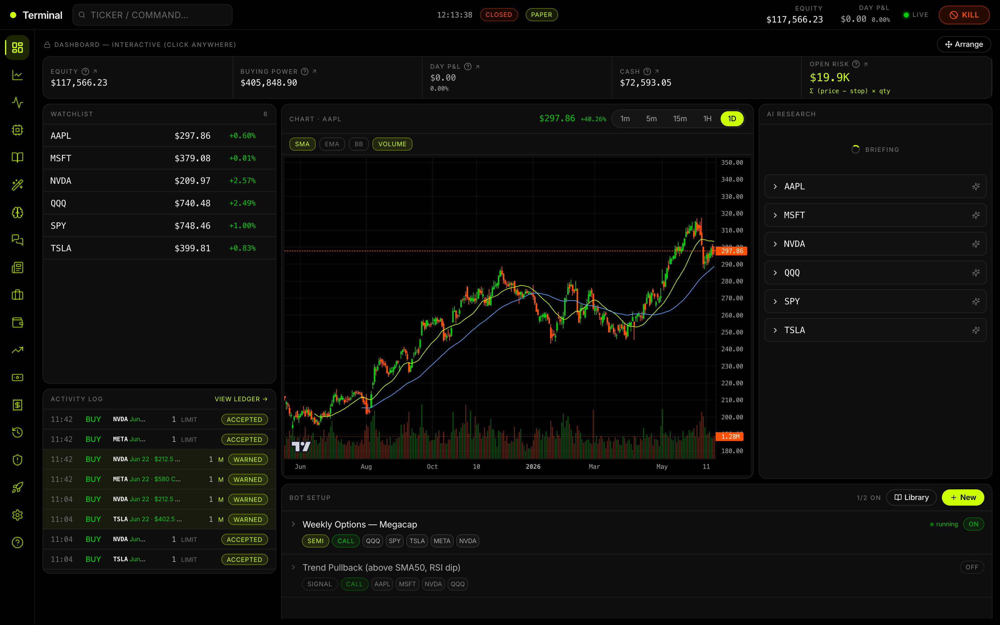

### Strategy Library — goal-based prebuilt bots + research-backed templates
Pick an outcome (Conservative → YOLO) or build from a documented strategy; one-click **Add as Bot**.
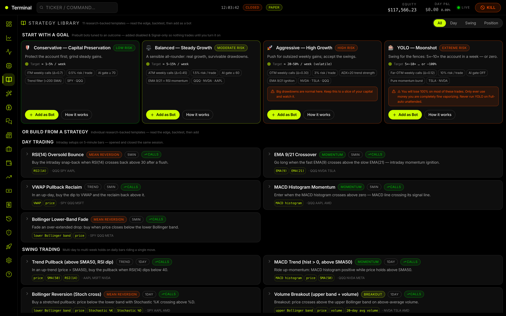

### Backtest — real Alpaca history in actual dollars
Set your starting cash and max bet per trade; get net P&L $, ending balance, equity curve and a per-trade ledger.
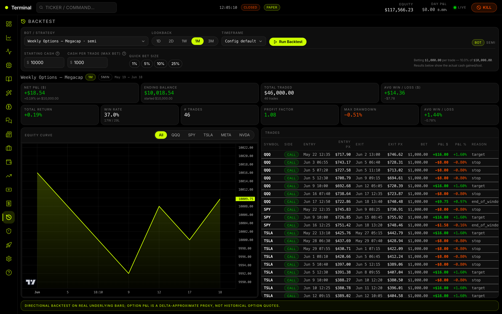

### Portfolio — equity curve, allocation & holdings (live Alpaca paper account)
Every top-bar stat links to a dedicated page: equity → Portfolio, day P&L → P&L history, buying power → Buying Power.
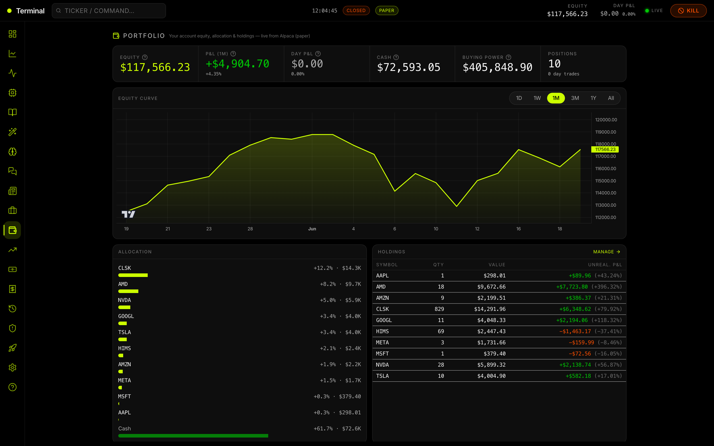

### Risk — prebuilt risk profiles, hard limits, position sizer & kill switch
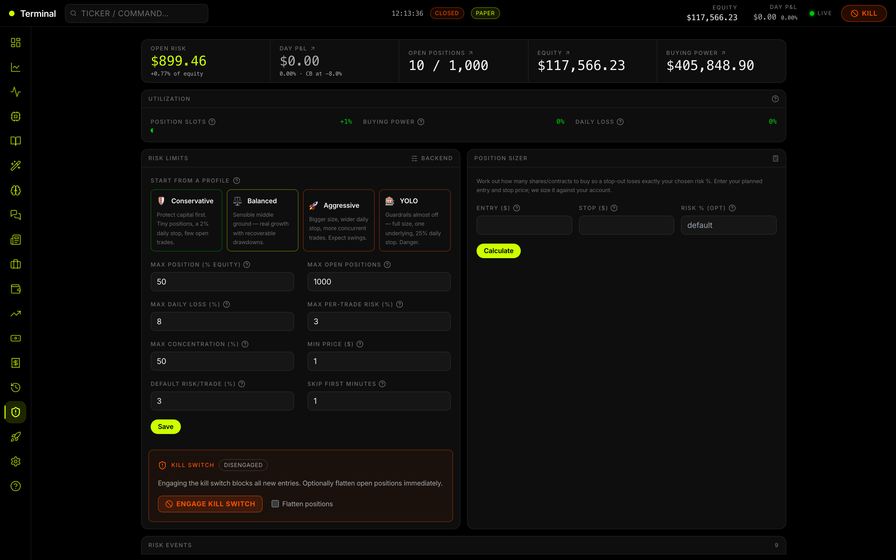

<table>
<tr>
<td width="50%"><b>P&L history</b> (date-range, per-period histogram)<br/>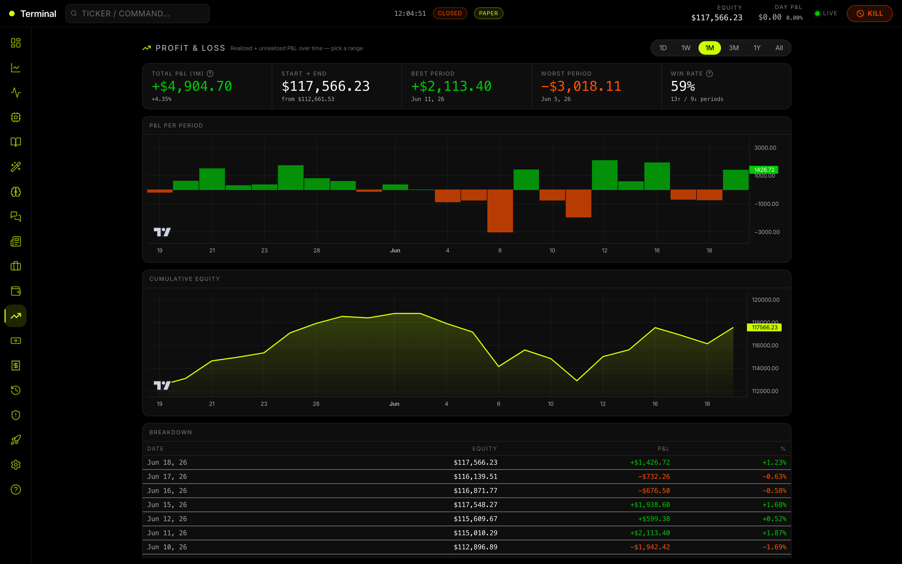</td>
<td width="50%"><b>Buying Power</b> (totals, reserved, education)<br/>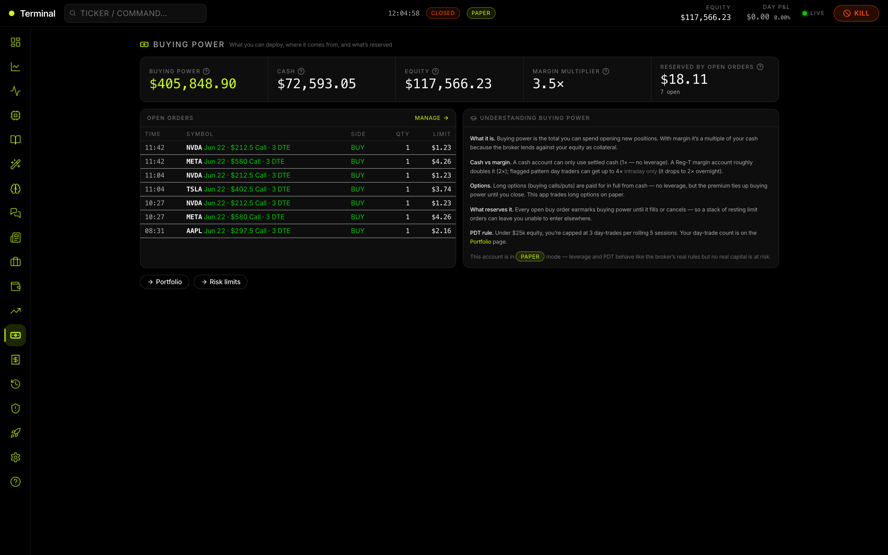</td>
</tr>
<tr>
<td width="50%"><b>Options Flow</b><br/>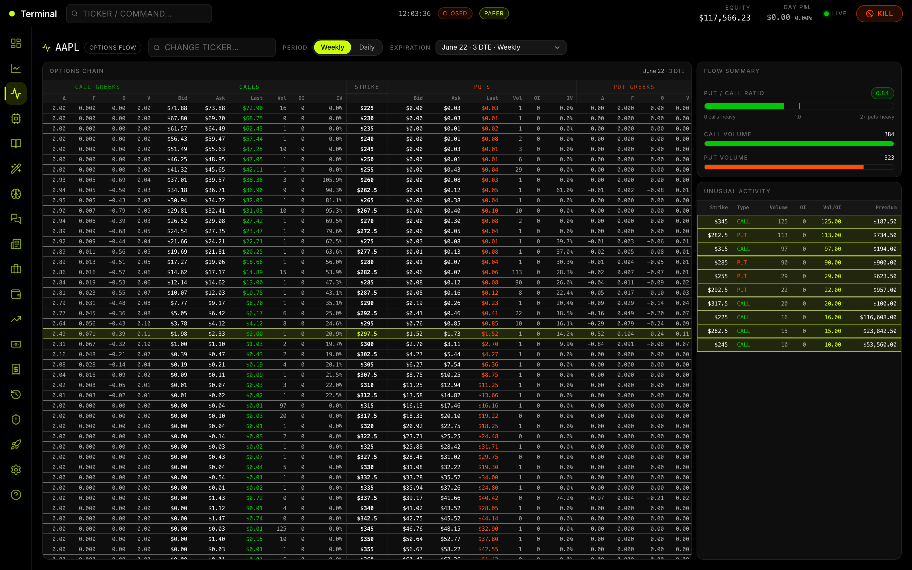</td>
<td width="50%"><b>Guided Bot Builder</b><br/>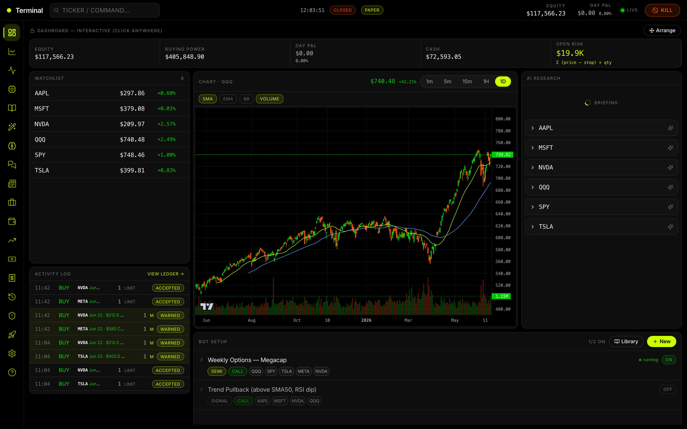</td>
</tr>
<tr>
<td width="50%"><b>Trades ledger</b> (plain-English contracts)<br/>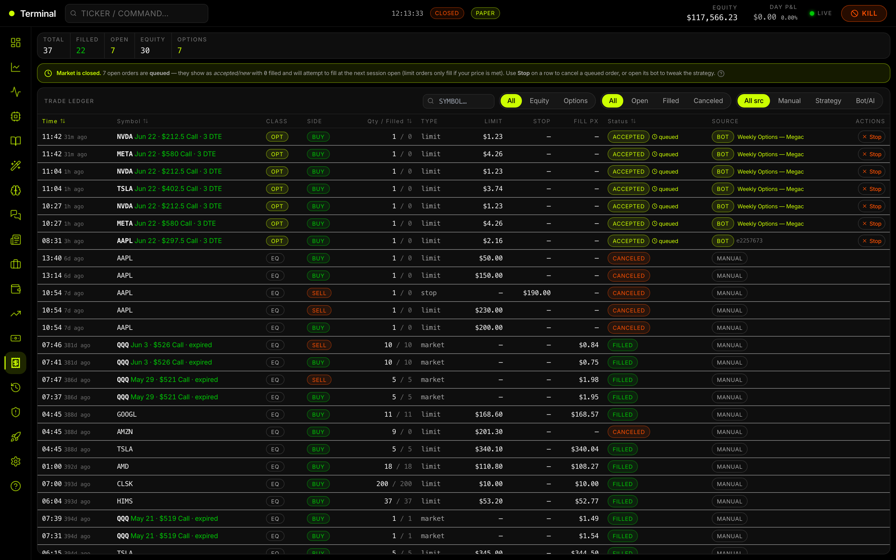</td>
<td width="50%"><b>Positions & Orders</b> (quick buy/sell)<br/>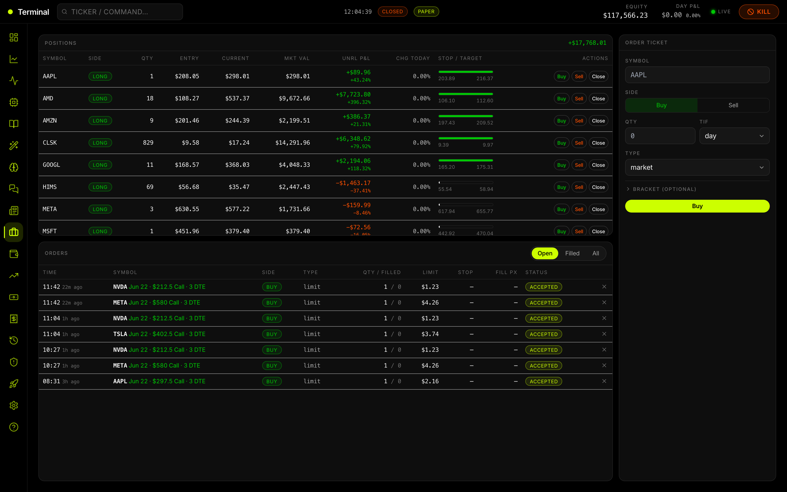</td>
</tr>
<tr>
<td width="50%"><b>AI Research</b> (local Gemma + Kimi)<br/>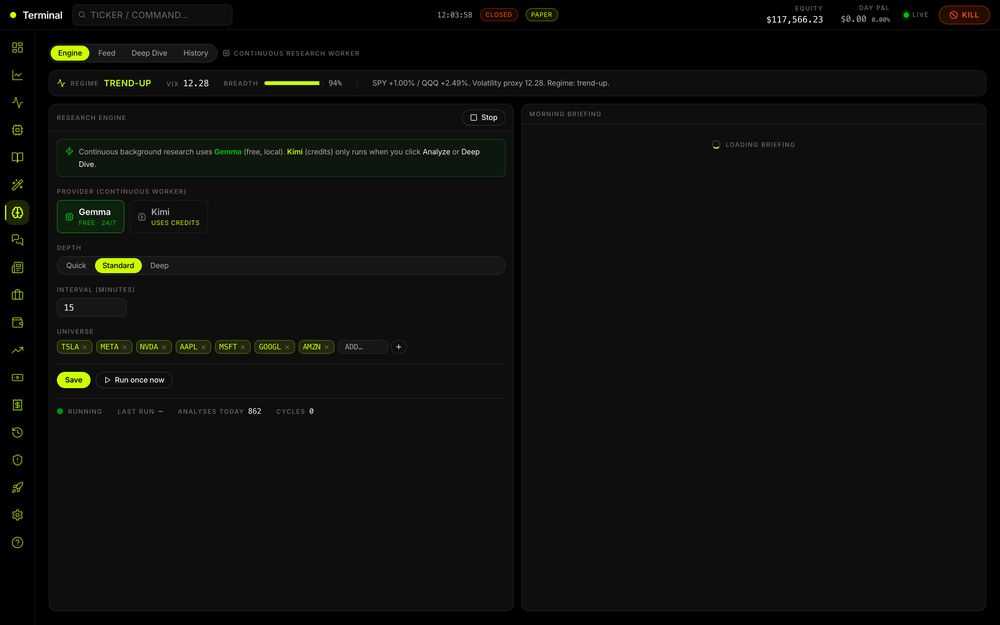</td>
<td width="50%"><b>Chat over your DB</b> (Vanna-style + RAG)<br/>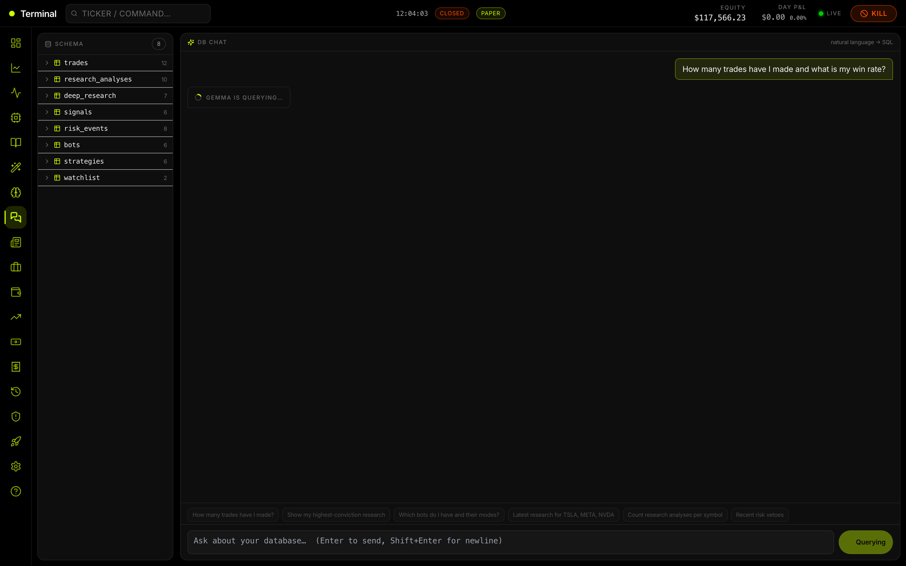</td>
</tr>
</table>

---

> ⚠️ **Educational project — not financial advice.** Automated trading can lose money rapidly. Paper/backtest results don't guarantee live performance. The AI can be confidently wrong — that's why a deterministic risk engine has veto power over every order. Trade live only with money you can afford to lose.

---

## Core principle

**The LLM proposes; deterministic code disposes.** AI generates theses and signals, but a rule-based **risk engine validates every order** against hard limits before anything reaches the broker. AI is used for *information processing* (news/sentiment/regime), never as the last line of defense.

---

## Features

- **Dashboard** — draggable/resizable tiles (lock/Arrange toggle, responsive autofit): equity + **open risk**, live watchlist, candlestick chart with indicator overlays, AI research feed, activity log, bot setup.
- **Builder** — a guided wizard: pick ticker → entry trigger (e.g. *RSI crosses above 32 on 5m*) → action (**buy calls/puts**, pick the exact contract from the **live options chain** at ATM/OTM/ITM) → sizing/risk/mode → save.
- **Options Flow** — real Alpaca chains, weekly/daily, greeks/IV, put/call ratio, unusual-activity detection.
- **Research** — **Kimi** (cloud) on-demand deep dives + a **free local Gemma** worker researching MAG7 (TSLA/META/NVDA focus) **24/7**, with earnings notes; all persisted and browsable.
- **Strategy Library** — 12 research-backed day/swing/position templates (RSI bounce, EMA crossover, MACD momentum, Bollinger reversion, Golden Cross, …) with education; one-click **Add as Bot**, inline **Backtest**, or **Customize** in the Builder.
- **Builder** — guided wizard with per-indicator **hints + suggested triggers**, education on every setting (sizing, risk %, stop/target, AI gate, mode), and an **inline backtest** to test/alter a draft before saving.
- **Backtest** — run any bot/strategy over real Alpaca history (1D–3M): equity curve, win rate, profit factor, drawdown, trade list.
- **Bot explainability** — every bot shows, per symbol, whether it's firing and *why not* (each trigger with its actual value, the AI gate, the chosen contract, and risk vetoes).
- **Chat (Vanna-style + RAG)** — ask in plain English; a local model writes **read-only SQL** over your DB, OR retrieves from a **RAG index** of your trades/logs/research (local embeddings) and an auto-computed **insights** layer to answer "how are my bots doing / what should I improve?" with grounded suggestions.
- **Risk** — position sizing, max position/concentration, daily-loss circuit breaker, per-trade R, kill switch; every veto is logged.
- **Trades / Positions / News / Settings / Onboarding / Help**.

---

## Architecture

```
            ┌──────────────────────────────────────────────┐
            │   React + TypeScript + Vite frontend (SPA)    │
            │   embedded into the Rust binary at build time │
            └───────────────┬──────────────────────────────┘
                            │  /api (REST)  +  /ws (WebSocket)
            ┌───────────────▼──────────────────────────────┐
            │        Rust / axum backend (backend-rs)       │
            │  strategy · risk engine · options · bots ·    │
            │  research · Vanna chat · 24/7 worker · sync   │
            └───┬───────────────┬───────────────┬───────────┘
                │               │               │
         ┌──────▼─────┐  ┌──────▼──────┐  ┌─────▼──────┐
         │  Alpaca    │  │  Kimi /     │  │ MySQL  or  │
         │ (paper)    │  │  Ollama     │  │ SQLite     │
         │ trading +  │  │ (Gemma)     │  │ (auto-     │
         │ data + opt │  │ research+   │  │  synced)   │
         │ + news     │  │ chat        │  │            │
         └────────────┘  └─────────────┘  └────────────┘
```

The native macOS app wraps this same backend in a Tauri window using **SQLite**; the web build uses **MySQL**.

---

## Prerequisites

| Need | For | Install |
|---|---|---|
| **Alpaca paper account + API keys** | trading & market data | https://app.alpaca.markets (free) |
| **Rust** (stable) | the backend / native app | https://rustup.rs |
| **Node.js 20+** | building the frontend | https://nodejs.org |
| **Ollama** + `gemma4:e2b` | free local AI (worker + chat) | https://ollama.com → `ollama pull gemma4:e2b` |
| **MySQL** (e.g. [MAMP](https://www.mamp.info)) | the **web** build & cross-sync | MAMP defaults: `127.0.0.1:8889`, `root`/`root` |
| **Kimi key** *(optional)* | best on-demand research | https://platform.kimi.ai — omit to use free Gemma only |
| **Tauri CLI** *(for the .app)* | building the macOS app | `cargo install tauri-cli` or `npm i -g @tauri-apps/cli` |

> The **native macOS app needs no MySQL** (it uses embedded SQLite). MySQL is only required for the web build and for cross-device sync.

---

## Quick start

```bash
git clone https://github.com/erichers/ai-trading-bot.git
cd ai-trading-bot

# 1) Configure secrets (never committed)
cp .env.example .env
#    → edit .env: add your ALPACA_API_KEY / ALPACA_SECRET_KEY (required)
#      and optionally KIMI_API_KEY (else research runs on free local Gemma)

# 2) Local AI (free)
ollama pull gemma4:e2b      # and make sure `ollama serve` is running

# 3a) WEB build (needs MySQL running — e.g. start MAMP):
./run-native.sh            # builds the frontend + Rust release, serves http://localhost:8001
                           # (creates the `trading_terminal` MySQL db if missing)

# 3b) NATIVE macOS app (embedded SQLite, no MySQL needed):
cd frontend && npm run build && cd ..
cd app-native/src-tauri && cargo tauri build --bundles app
open "target/release/bundle/macos/AI Trading Terminal.app"
```

That's it — open `http://localhost:8001` (web) or the `.app` (native).

---

## Running each form

### 🌐 Web app (Rust + MySQL)
- One command: **`./run-native.sh`** — ensures Ollama + MySQL, builds, runs on **http://localhost:8001**.
- Manual: `cd frontend && npm run build` then `cd backend-rs && cargo run --release` (defaults to `DB_BACKEND=mysql`).
- Dev with hot reload: `cd frontend && npm run dev` (Vite on :5173, proxies to the backend on :8001).

### 🖥️ Native macOS app (Tauri + embedded SQLite)
- Build: `cd app-native/src-tauri && cargo tauri build --bundles app` (build `frontend/` first so the embedded UI is current).
- The app stores its database at `~/Library/Application Support/com.orcounselors.tradingterminal/trading_terminal.db`.
- **Unsigned build:** on first launch macOS Gatekeeper may block it — **right-click → Open** (or `xattr -dr com.apple.quarantine "<app>"`).

### 🚀 Desktop launcher (one-click everything)
`Trading Terminal.app` on the Desktop (compiled from `app-native/launcher/launcher.applescript`):
- **On open:** starts Ollama (if down) + MySQL (if down), then launches the app.
- **On close:** stops MySQL it started (after a final sync) but **leaves Ollama running** so Gemma stays available in the background.

---

## Data & sync

- **Web** → MySQL `trading_terminal`. **Native app** → embedded SQLite. Identical schema (trades, research, deep research, signals, risk events, bots, strategies, watchlist, settings…).
- **Auto-sync** (native app only): pulls MySQL→SQLite on launch, syncs every ~2 min, pushes SQLite→MySQL on quit — bidirectional merge with dedup. If MySQL is unreachable it simply skips. Manual trigger: `POST /api/sync`; status: `GET /api/sync/status`.

---

## Project structure

```
backend-rs/     Rust/axum backend (primary) — lib + binary; MySQL & SQLite; sync; embedded SPA
app-native/     Tauri macOS app (embedded SQLite) + Desktop launcher (AppleScript)
frontend/       React + TS + Vite SPA (built into the backend binary)
backend/        Original Python/FastAPI implementation (reference / alternative)
deploy/         Optional Apache vhost (legacy /sandbox serving)
run-native.sh   One-command web launcher
.env.example    Copy to .env and fill in your keys
```

---

## Security

- **Secrets live only in `.env`** (gitignored, never committed). The app reads them at runtime — they are **not** bundled into the binary or the `.app`. For a portable install, place credentials in `~/.config/trading-terminal/.env`.
- Verified: no API keys or secrets exist anywhere in the tracked files or git history.
- Stays in **paper mode** (`ALPACA_PAPER_TRADE=true`) until you deliberately switch to live keys.
- The chat's text-to-SQL is **read-only** (SELECT-only, validated, auto-LIMIT).

---

## Troubleshooting

- **Blank page** → a backend isn't running, or (web build via Apache) Apache stopped. Start the backend; the binary prints its URL. Boot errors now render on-page instead of a white screen.
- **Research returns nothing / falls back to Gemma** → check `KIMI_API_KEY`; Kimi reasoning models take ~60–90s (there's a spinner). Free Gemma always works if Ollama is running.
- **Chat / worker errors** → ensure `ollama serve` is up and `gemma4:e2b` is pulled.
- **Native app won't open** → unsigned build; right-click → Open once.
- **Sync does nothing** → MySQL isn't reachable; start MAMP. Sync is best-effort and never blocks the app.

---

## License & disclaimer

MIT. Provided for educational purposes only; not financial, investment, or trading advice. Stops and conditional orders are best-effort and can fail near the close or during outages. You are solely responsible for any trading decisions and losses.
